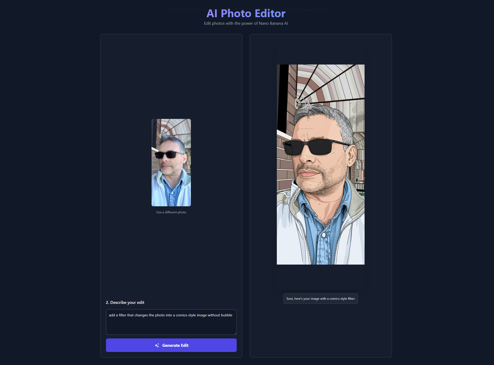

# AI Photo Editor

An **AI-powered photo editor** built with **React**, **TypeScript**, and **Vite**.  
This application allows users to upload, process, and edit images using AI services.  

## 📊 Status


---

## 🚀 Features
- 📤 Upload and preview images  
- ✨ AI-powered image editing with custom services  
- ⚡ Fast build and hot reload with **Vite**  
- 🎨 Clean UI with reusable React components  
- 🔧 Written in **TypeScript** for type safety  

---

## 🛠️ Tech Stack
- **Frontend:** React + TypeScript  
- **Build Tool:** Vite  
- **Package Manager:** npm  
- **AI Service:** Custom integration via `geminiService.ts`  
- **Environment Config:** `.env` file for API keys and settings  

---

## 📂 Project Structure
```
AI_Photo_Editor/
│── .env                 # Environment variables (not committed)
│── index.html           # App entry point
│── package.json         # Dependencies and scripts
│── vite.config.ts       # Vite configuration
│
├── src/
│   ├── App.tsx          # Main application component
│   ├── index.tsx        # React root rendering
│   ├── constants.ts     # App constants
│   ├── types.ts         # TypeScript types
│   ├── metadata.json    # Metadata for AI/editor
│   │
│   ├── components/      # UI components
│   │   ├── Icon.tsx
│   │   ├── ImageUpload.tsx
│   │   └── Spinner.tsx
│   │
│   └── services/
│       └── geminiService.ts   # AI service integration
```

---

## ⚙️ Installation & Setup

1. **Clone the repository**
   ```bash
   git clone https://github.com/your-username/AI_Photo_Editor.git
   cd AI_Photo_Editor
   ```

2. **Install dependencies**
   ```bash
   npm install
   ```

3. **Create `.env` file**  
   Add your API keys and environment variables inside `.env` (example):
   ```
   VITE_API_KEY=your_api_key_here
   ```

4. **Run development server**
   ```bash
   npm run dev
   ```

5. **Build for production**
   ```bash
   npm run build
   ```

---

## 🖼️ Preview
`)
  
---

## 📖 Usage
1. Upload an image using the **Upload button**.  
2. Wait for the AI to process your photo.  
3. View and download the edited image.  

---

## 📜 License
This project is licensed under the **MIT License**.  
Feel free to use, modify, and distribute this project.  

---

## 👤 Author
Developed by Stefano Cavalli.  
Contributions, issues, and feature requests are welcome!  
